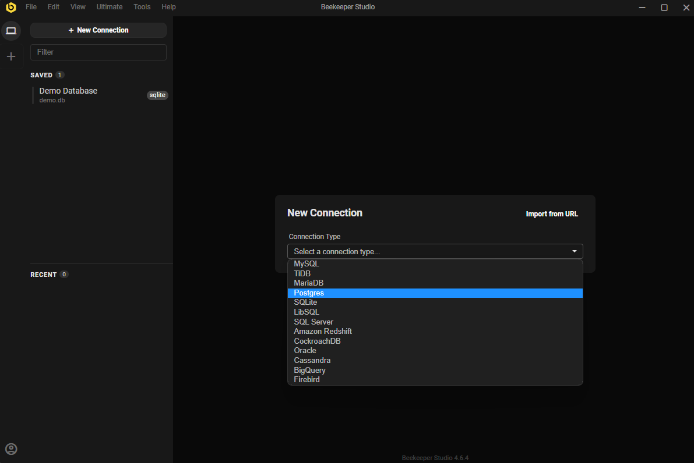
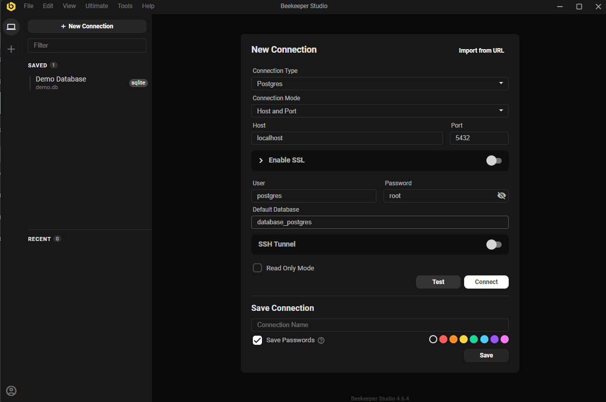
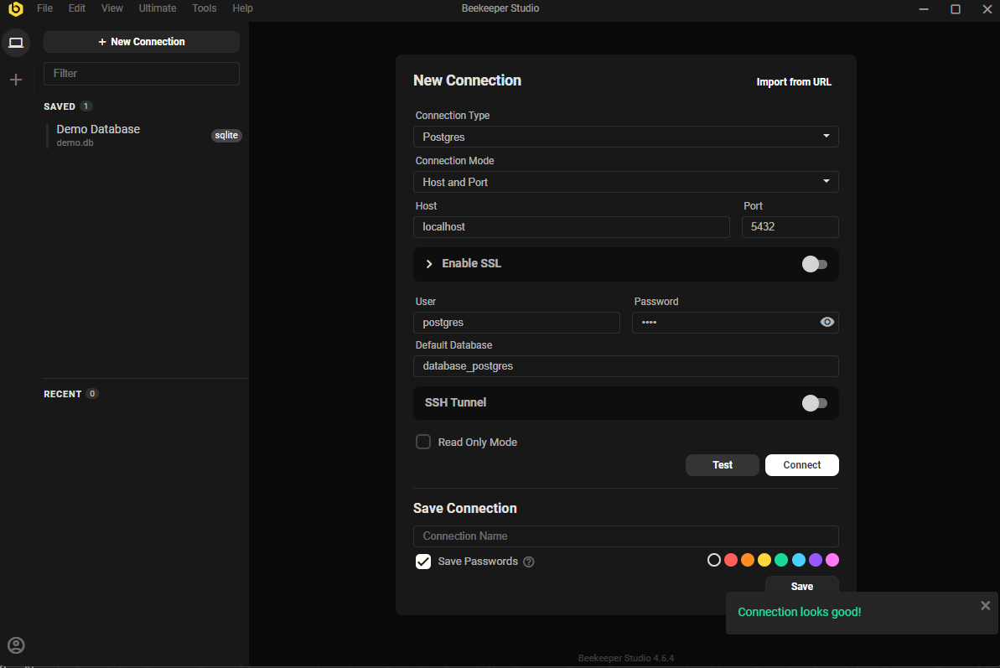
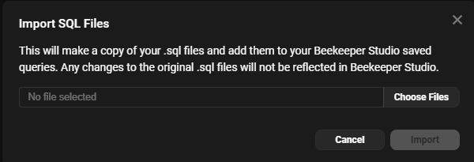
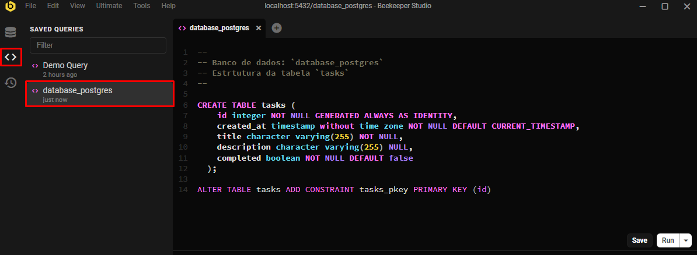
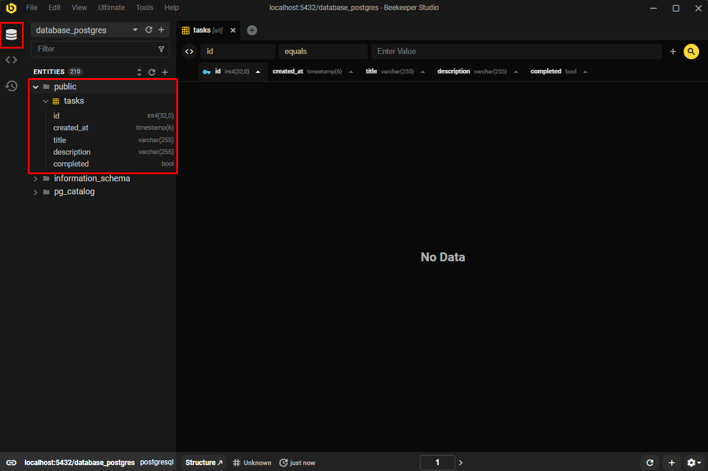

<h1 align="center">
	Sistema de Gerenciamento de Tarefas
</h1>

<p align="center">
  <a href="https://curriculum-vitae-jacksonsantin.vercel.app">
    
  </a>
</p>

<p align="center">
 <a href="#-sobre-o-projeto">Sobre</a> •
 <a href="#-como-está-dividido-o-projeto">Como está dividido o projeto</a> •
 <a href="#-tecnologias">Tecnologias</a> •
 <a href="#-autor">Autor</a>
</p>

## 💻 Sobre o projeto

**Gerenciador de tarefas** - Aplicação desenvolvida com base num desafio proposto onde, o principal objetivo é criar um projeto totalmente do 0 capaz de realizar um CRUD para gerenciamento das suas tarefas.

<br>

## 🚀 Como está dividido o projeto

Este projeto é divido em duas partes:

1. Back-end (pasta backend)
2. Front-end (pasta frontend)

💡O Front-end precisa que o Back-end esteja sendo executado para funcionar.

### Pré-requisitos

Antes de começar, você vai **_precisar_** ter instalado em sua máquina as seguintes ferramentas:

- [Git](https://git-scm.com);
- [Node.js](https://nodejs.org/en/) + NPM;
- [Docker](https://www.docker.com/);

> Se desejar, ao invés do NPM, pode utilizar o [Yarn](https://classic.yarnpkg.com/lang/en/docs/install/#windows-stable)

Caso seu sistema operacional não seja Linux, você precisará ter configurado o [WSL 2](https://learn.microsoft.com/pt-br/windows/wsl/install) que permite que os desenvolvedores instalem uma distribuição do Linux para utilizar aplicativos, utilitários e ferramentas de linha de comando bash do Linux diretamente no Windows, além disso, sugiro também ter o app [Windows Terminal](https://www.microsoft.com/store/productId/9N0DX20HK701?ocid=pdpshare) para facilitar.

Como editor de código, recomendo o [VSCode](https://code.visualstudio.com/).

Você também pode utilizar uma ferramenta para poder consumir a API back-end, para esse projeto, utilizamos o [Insomnia](https://insomnia.rest/).

#### 🎲 Rodando o Back-end (backend)

```bash
# Clone este repositório
$ git clone git@github.com:JacksonSantin/gerenciador-tarefas.git

# Acesse a pasta do projeto no terminal/cmd
$ cd gerenciador-tarefas

# Vá para a pasta backend
$ cd backend

# Rode o comando para iniciar o back-end
$ docker-compose up --build -d
```

<p align="center">
  <a href="https://github.com/JacksonSantin/gerenciador-tarefas/blob/main/backend/insomnia/Insomnia_2024-07-16_desafio_objetiva.json" target="_blank"></a>
</p>

Antes de rodar a aplicação front-end, é preciso ter o banco de dados configurado com as devidas tabelas e colunas, para isso, utilizei como gerenciador de banco de dados o [Beekeeper Studio](https://www.beekeeperstudio.io/), mas fica ao seu critério qual gerenciador irá querer utilizar, no caso, abaixo, mostrarei o passo a passo para importar o SQL pelo Beekeeper.

1. Baixe o arquivo [database_postgres.sql](https://github.com/JacksonSantin/gerenciador-tarefas/blob/main/backend/script_bd/database_postgres.sql) na sua máquina;
2. Abra o Beekeeper Studio e na combo-box selecione o Postgres;
   

3. Preencha os campos "User", "Password" e "Default Database" conforme as informações da imagem abaixo. **É importante ser igual, pois é o que está configurado no .env da aplicação e que o docker irá ler para se conectar ao banco corretamente**.
   

4. Teste a conexão no botão "Test";
   
5. Se a conexão for bem sucedida, conecte-se ao banco de dados no botão "Connect";
6. Após estar conectado, vá no menu `File >> Import SQL Files`;
   
7. Após importar, ele irá aparecer nesse menu, basta selecionar ele (com dois cliques) e rodar o SQL no botão "Run";
   
8. Ao voltar para o primeiro menu, verá que irá aparecer um schema chamado `public` e dentro desse schema estará a tabela `tasks` e suas devidas colunas.
   

#### 🧭 Rodando a aplicação Front-end (frontend) com NPM

```bash
# Vá para a pasta frontend
$ cd frontend

# Instale as dependências
$ npm i

# Execute a aplicação
$ npm run serve

# No terminal será exibido o link em que poderá visualizar a aplicação front-end rodando, geralmente na http://localhost:8080, mas pode variar se já estiver com essa porta ocupada.
```

#### 🧭 Rodando a aplicação Front-end (frontend) com Yarn

```bash
# Vá para a pasta frontend
$ cd frontend

# Instale as dependências
$ yarn i

# Execute a aplicação
$ yarn run serve

# No terminal será exibido o link em que poderá visualizar a aplicação front-end rodando, geralmente na http://localhost:8080, mas pode variar se já estiver com essa porta ocupada.
```

<br>

## 🛠 Tecnologias

As seguintes ferramentas foram usadas na construção do projeto:

#### **Frontend** ([Vue](https://vuejs.org/) + [Vuetify](https://vuetifyjs.com/en/))

- **[Axios](https://github.com/axios/axios)**
- **[Dayjs](https://day.js.org/)**
- **[Toastify](https://apvarun.github.io/toastify-js/)**

> Veja o arquivo [package.json](https://github.com/JacksonSantin/gerenciador-tarefas/blob/main/frontend/package.json)

#### **Backend** ([PHP](https://www.php.net/))

- **[Docker](https://www.docker.com/)**
- **[Nginx](https://nginx.org/en/)**
- **[PostgreSQL](https://www.postgresql.org/)**

#### **Utilitários**

- Editor: **[Visual Studio Code](https://code.visualstudio.com/)**
- Gerenciador de BD: **[Beekeeper Studio](https://www.beekeeperstudio.io/)**

<br>

## 🦸 Autor

<table>
  <tr>
    <td align="center"><a href="https://about-me-jacksonsantin.vercel.app/"><br /><sub><b>Jackson Dhanyel Santin</b></sub></a></td>
  </tr>
</table>

<a href="https://instagram.com/jackson_santin" target="_blank"></a>
<a href="https://twitter.com/dhanyeljack" target="_blank"></a>
<a href="https://fb.com/jackson.santin.52" target="_blank"></a>
<a href = "mailto:jackdhanyelsn@gmail.com"></a>
<a href="https://www.linkedin.com/in/jackson-dhanyel-santin" target="_blank"></a>
<a href="https://about-me-jacksonsantin.vercel.app/" target="_blank"></a>

<br>

## 📝 Licença

Este projeto esta sobe a licença [MIT](https://github.com/JacksonSantin/gerenciador-tarefas/blob/main/LICENSE).

Feito com ❤️ por Jackson Dhanyel Santin 👋🏽 [Entre em contato!](https://about-me-jacksonsantin.vercel.app)
